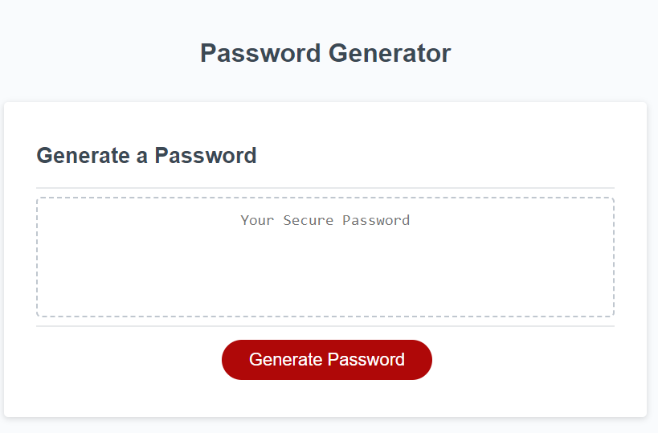

# Password-Generator
Generate random passwords based on user defined criteria.

## How to Use

1. When the page loads, click in the Generate Password button.
2. Enter a password length between 8 and 128 characters.
3. You will be prompted about which character types to use. Choose OK or Cancel as desired.
4. A new password will be generated based on your criteria and displayed in the "Your Secure Password" field.

## Demo

## Resources

This page was made using HTML, CSS, and JavaScript.

## Repository and Deployed webpage

https://github.com/ReedHMartin/03-Password-Generator \
https://reedhmartin.github.io/03-Password-Generator

